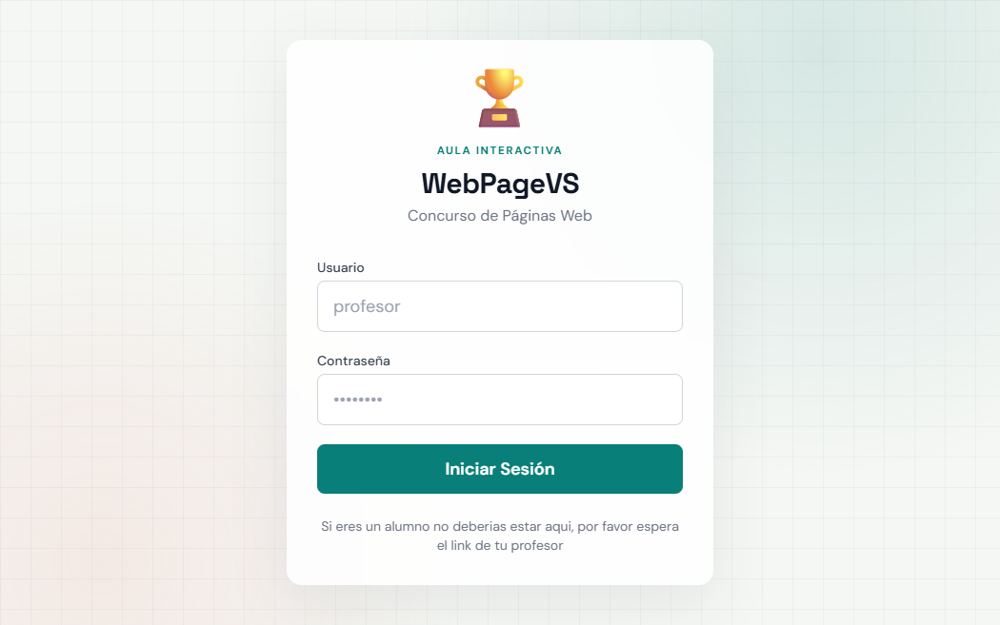
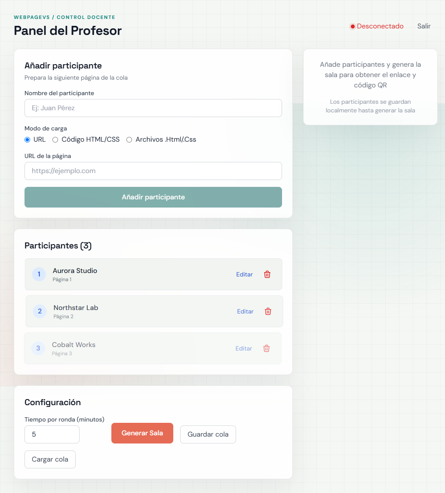
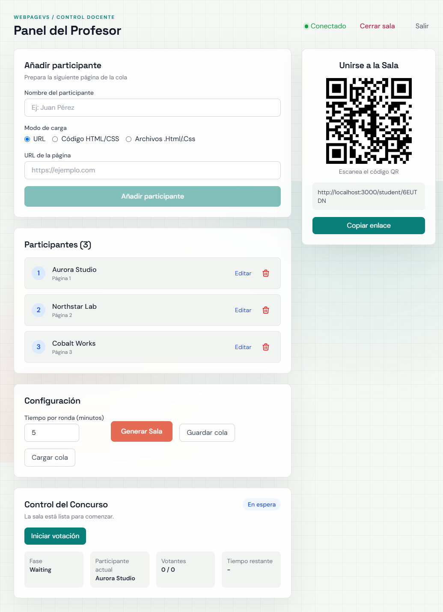

# WebPageVS



**WebPageVS** es una plataforma para organizar concursos de páginas web en clase. El profesor prepara una cola de proyectos, comparte una sala y guía una ronda de votación en tiempo real mientras los alumnos visualizan cada propuesta desde su propio dispositivo.

> Diseñado para una clase de programación: rápido de preparar, sencillo de compartir y claro durante la competición.

## Vista rápida

### Preparar la cola

El profesor puede añadir páginas mediante URL, código HTML/CSS o archivos `.html` y `.css`. La cola se puede editar, guardar como JSON y reutilizar para crear nuevas salas.



### Crear y compartir una sala

Cada sala genera un código y un código QR para que los alumnos entren desde sus móviles. El estado de la competición se sincroniza mediante WebSocket.



## Características

- Panel docente con estados de sala y controles coherentes con cada fase.
- Creación, edición y eliminación de participantes antes de comenzar.
- Salas en tiempo real con código, URL y QR.
- Votación por coherencia, esfuerzo y originalidad.
- Resolución automática de empates con incrementos de `+0.1`.
- Podio final y exportación de resultados a CSV.
- Renderizado de HTML/CSS compatible con el flujo de Tailwind Play.
- Cierre de sala para reutilizar la cola y crear una nueva competición.
- Interfaz responsive para ordenador, tablet y móvil.

## Stack

- **Frontend:** React, TypeScript, Vite, Tailwind CSS y Framer Motion.
- **Backend:** Node.js, Express, TypeScript y WebSocket (`ws`).
- **Persistencia:** estado de salas en memoria y colas locales en `sessionStorage`.

## Instalación

Requisitos: Node.js 18 o superior.

```bash
npm run install:all
npm run dev
```

La aplicación queda disponible en:

- Frontend: `http://localhost:5173`
- Backend: `http://localhost:3000`

El acceso local usa las variables `ADMIN_USER` y `ADMIN_PASS` del archivo `.env`. Si no existen, el fallback de desarrollo es `admin` / `admin123`.

## Uso en clase

1. El profesor inicia sesión y prepara la cola.
2. Pulsa **Generar Sala**.
3. Comparte el enlace o el QR con los alumnos.
4. Inicia la votación y controla cada participante desde el panel.
5. Al terminar, muestra el podio o exporta el CSV.
6. Cierra la sala para volver a editar la cola y preparar otra ronda.

## Compartirlo fuera de la red local

`localhost` solo funciona en el equipo donde se ejecuta la aplicación. Para que los alumnos se conecten desde sus propios dispositivos, el backend debe desplegarse en una URL pública con WebSocket habilitado y el frontend debe apuntar a ese mismo dominio.

Antes de publicar el proyecto:

- Cambia las credenciales de administrador mediante variables de entorno.
- Usa HTTPS para que el QR genere enlaces seguros y los WebSocket usen `wss://`.
- Configura límites y autenticación adecuados si la aplicación se usará fuera del aula.

## Scripts

```bash
npm run dev          # frontend y backend en desarrollo
npm run server       # servidor compilado
npm run client       # build del frontend y arranque del servidor
npm run install:all  # instala las dependencias de todos los paquetes
```

## Estructura

```text
client/   Interfaz React y páginas de profesor/alumno
server/   API Express, autenticación y WebSocket
```

## Estado del proyecto

Proyecto académico en evolución para una clase de programación. La aplicación está preparada para pruebas locales y para continuar con el despliegue público, persistencia de salas y autenticación más completa.